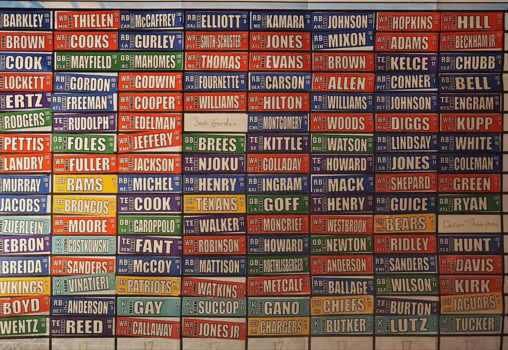

```{r global_options, include=FALSE}
knitr::opts_chunk$set(fig.width=12, fig.height=8, fig.path='Figs/',
                      echo=FALSE, warning=FALSE, message=FALSE)
options(width=100)
```

```{r setup, include=FALSE}
knitr::opts_chunk$set(echo = TRUE)
```

## Introduction

The analysis below explores the performance of my friends during our 2019 Fantasy Football Draft. Since 2016 we have been drafting in a no-cheatsheet environment which means that each drafter must know who they are going to draft before the draft starts. As such the performance of each drafter could vary wildly and is thus an interesting phenomena to explore. 

Note that I am using the ESPN Top 300 PPR rankings as a proxy for ground truth. Many of the rankings there are debatable but I think overall it gives a good rough estimate of each player's value.

The source and data for this project are available at https://github.com/EvanOman/FantasyFootball2019. My contact info is available on my website: http://www.evanoman.com.

Let the fun begin!

## Data Preparation

First we load in the draft data. The data is recorded in the same matrix format as the draft board:



Just like 2016 and 2017, this data needs to be adjusted to get into the format we want (i.e. one row per draft selection). We will begin by loading the draft data.

```{r}
draftData <- read.csv("./data/Draft2019.csv", stringsAsFactors = F)
print.data.frame(head(draftData), row.names=FALSE)
```

As you can see, the data is organized by round with a column for each drafter. This format is often referred to as a “wide data-set.” For this analysis we want a “tall data set” so we will use the “melt” function to reorganize the data into one row per data point (ie one row per pick).

```{r}
library("reshape2")
library("plyr")

# Add a "ROUND" Column
draftData$ROUND = 1:16

# Melt the data
draftData <- melt(draftData, id.vars = "ROUND")

# Drop the row names
rownames(draftData) <- NULL

# Order by round (this is a stable sort)
draftData <- draftData[order(draftData$ROUND), ]

# Rename some columns
draftData <- rename(draftData, c("variable" = "Drafter", "value" = "Player", "ROUND" = "Round"))

print.data.frame(head(draftData, n=10), row.names=FALSE)
```

Now that we have the data in a tall form, we want to know what the actual number for each pick. This is complicated by the winding nature of the draft order (Chris had the 8th and 9th picks). To capture this behavior I have written the following “snake function” which creates a sequence which winds up to 8 and then counts down from 16, up to 24, etc.

```{r}
# Creates the sequence: 1,2,3,4,5,6,7,8,16,15,14,13,12,11,10,9,17,18,19,20....
snakeFunction <- function(n, rowLen=8)
{
  lapply(1:n, function(i){
    groupIndicator <- ceiling(i / rowLen)
    # Increasing group
    if (groupIndicator %% 2 == 1)
    {
      i
    }
    # Decreasing group
    else
    {
      rowLen*groupIndicator - ((i - 1) %% rowLen)
    }
  })
}

# Create the list for out draft (8 drafters, 16 rounds)
pickOrdering <- snakeFunction(8*16)

unlist(pickOrdering)
```

We can then use this pick ordering list to index the draft picks in our draft data frame.

```{r}
# Add the pick numbers to the draft data
draftData$PickNumber <- pickOrdering
draftData <- as.data.frame(lapply(draftData, unlist))

# Order the draft data by pick number
draftData <- draftData[order(draftData$PickNumber),]

print.data.frame(head(draftData, n=10), row.names=FALSE)
```

Now that the draft data has been prepped, we can load in the rankings data: 

```{r}
rankings <- read.csv("./data/EspnPprRankings2019.csv", stringsAsFactors = F)

# Read player as string, not factor
rankings$Player <- as.character(rankings$Player)

# Add "Rank" column sequentially
rankings$Rank <- 1:nrow(rankings)

print.data.frame(head(rankings, n=10), row.names=FALSE)
```

This dataset is already in the tall format we want so there will be no reformating needed. With all of the data prepared we can just join `draftData` with `rankings` by `Player`. Note that this is a left join by default so the resulting dataframe will only contain rows from our draft dataframe. The ranking dataset only includes the top 300 players. Thus some players will not have a ranking so after the join these players will have a `NA` rank. We will replace this with the worst possible ranking (`nrow(rankings)`) plus `1`.

```{r}
library("plyr")

# Join rankings data with draft data 
joinedData <- join(draftData, rankings, by="Player")

# Some players will not have a  ranking, give these players a worst ranking + 1
joinedData$Rank[is.na(joinedData$Rank)] <- nrow(rankings) + 1

print.data.frame(head(joinedData, n=10), row.names=FALSE)
```

We now have a dataframe with each draft pick with the corresponding pick number and player ranking. We can then use the pick number and player ranking to measure the quality of each draft pick.

```{r}
joinedData$RankDiff <- joinedData$Rank - joinedData$PickNumber

print.data.frame(head(joinedData, n=10), row.names=FALSE)
```

At this point all of the data has been prepped so we are ready to generate some plots and do a bit of analysis.

## Figures and Results

Probably the most natural measure of performance would be to look at the average difference between pick number and rank, across all rounds, organized by Drafter. We can calculate this using `aggregate`.

```{r}
avgDiffs <- aggregate(RankDiff ~ Drafter, joinedData, FUN=mean)

# Order factor by worst draft to best
avgDiffs <- within(avgDiffs, Drafter <- factor(Drafter, levels=avgDiffs[order(avgDiffs$RankDiff), "Drafter"]))

# Order dataframe by worst draft to best
avgDiffs <- avgDiffs[order(avgDiffs$RankDiff, decreasing = FALSE),]

print.data.frame(avgDiffs, row.names=FALSE)
```

Thus we can see that `r bd <- avgDiffs[which.min(avgDiffs$RankDiff),]; bd$Drafter` had the best draft (on average he got players `r bestDiff <- bd$RankDiff; abs(bestDiff)` positions `r if (bestDiff < 0) "under" else "over"` rank value) and `r wd <- avgDiffs[which.max(avgDiffs$RankDiff),]; wd$Drafter` had the worst (on average, he got players `r worstDiff <- wd$RankDiff; abs(worstDiff)` positions `r if (worstDiff < 0) "under" else "over"` rank value). Here is a quick visual of the above dataframe.

```{r}
library(ggplot2)
ggplot(avgDiffs, aes(x=Drafter, y=RankDiff)) + geom_bar(stat = "identity") + ylab("Mean Difference Between Pick # and Ranking")
```

Since kickers and defenses are generally ranked very low, and because I picked a bad kicker and defense, I was curious to see what these rankings look like without those position types:

```{r}
noKorDst <- joinedData[!(joinedData$Pos %in% list("DST", "K")), ]

avgDiffs2 <- aggregate(RankDiff ~ Drafter, noKorDst, FUN=mean)

# Order factor by worst draft to best
avgDiffs2 <- within(avgDiffs2, Drafter <- factor(Drafter, levels=avgDiffs[order(avgDiffs$RankDiff), "Drafter"]))

# Order dataframe by worst draft to best
avgDiffs2 <- avgDiffs2[order(avgDiffs2$RankDiff, decreasing = FALSE),]

print.data.frame(avgDiffs2, row.names=FALSE)
```
I was curious to see how undervalued/overvalued players were by position. We can use a similar methodology as above to figure this out.

```{r}
posDiffs <- aggregate(RankDiff ~ Pos, joinedData, FUN=mean)

posDiffs <- within(posDiffs, Pos <- factor(Pos, levels=posDiffs[order(posDiffs$RankDiff), "Pos"]))

# Order dataframe by worst draft to best
posDiffs <- posDiffs[order(posDiffs$RankDiff, decreasing = FALSE),]

print.data.frame(posDiffs, row.names=FALSE)

ggplot(posDiffs, aes(x=Pos, y=RankDiff)) + geom_bar(stat = "identity") + ylab("Mean Difference Between Pick # and Ranking")
```

Here we can see that `r bpd <- posDiffs[which.min(posDiffs$RankDiff),]; bestDiff <- bpd$RankDiff; bpd$Pos` were `r if (bestDiff < 0) "under" else "over"` valued by `r abs(bestDiff)` positions and `r wpd <- posDiffs[which.max(posDiffs$RankDiff),]; worstDiff <- wpd$RankDiff; wpd$Pos` were `r if (worstDiff < 0) "under" else "over"`valued by `r abs(worstDiff)` positions.

I was also curious to see how draft pick quality changed by round. In the next two figures I am plotting `Pick #` vs `Rank` with a diagonal line indicating a pick at the rank value. Thus all picks below this line are "good" and all of the above are "bad". In the first figure I colored the picks by Drafter and in the second I am coloring by position.

```{r}
# Scatter colored by drafter 
ggplot(joinedData, aes(x=PickNumber,y=Rank)) + geom_point(aes(color=Drafter)) + geom_abline() + xlab("Pick #")
```

```{r}
# Scatter colored by position 
ggplot(joinedData, aes(x=PickNumber,y=Rank)) + geom_point(aes(color=Pos)) + geom_abline() + xlab("Pick #")
```

It is pretty clear that as time goes on, worse and worse picks made.

Finally I wanted to see how each drafter performed by round, the following figure accomplishes this (here any pick below the dashed line is "good" and anything above the dased line is "bad").

```{r}
# Scatter colored by position, faceted by drafer
ggplot(joinedData, aes(x=Round, y=RankDiff)) + geom_line() + facet_wrap(~Drafter, ncol=2) + geom_hline(yintercept = 0, linetype=2) + geom_point(aes(color=Pos)) + ylab("Difference Between Pick # and Ranking")
```

## Conclusion
Here are some final take aways:

- **Best Draft:** `r bd <- avgDiffs[which.min(avgDiffs$RankDiff),]; bd$Drafter` (avg pick `r bestDiff <- bd$RankDiff; abs(bestDiff)` positions `r if (bestDiff < 0) "under" else "over"` rank value)
- **Worst Draft:** `r wd <- avgDiffs[which.max(avgDiffs$RankDiff),]; wd$Drafter` (avg pick `r worstDiff <- wd$RankDiff; abs(worstDiff)` positions `r if (worstDiff < 0) "under" else "over"` rank value)
- **Best Pick:** Drafter: `r p <- joinedData[which.min(joinedData$RankDiff),]; p$Drafter`, Round: `r p$Round`, Player: `r p$Player`,  Rank Difference: `r p$RankDiff`
- **Worst Pick:** Drafter: `r p <- joinedData[which.max(joinedData$RankDiff),]; p$Drafter`, Round: `r p$Round`, Player: `r p$Player`,  Rank Difference: `r p$RankDiff`